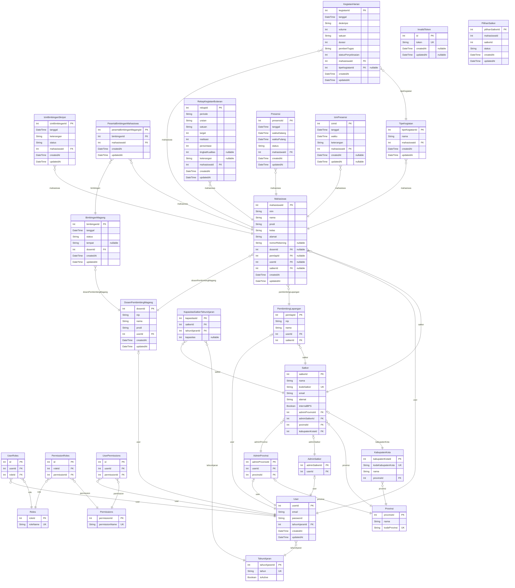

# Shopping Mall
> Generated by [`prisma-markdown`](https://github.com/samchon/prisma-markdown)

- [default](#default)

## default

### `TahunAjaran`

**Properties**
  - `tahunAjaranId`: 
  - `tahun`: 
  - `isActive`: 

### `User`

**Properties**
  - `userId`: 
  - `email`: 
  - `password`: 
  - `tahunAjaranId`: 
  - `createdAt`: 
  - `updatedAt`: 

### `Roles`

**Properties**
  - `roleId`: 
  - `roleName`: 

### `Permissions`

**Properties**
  - `permissionId`: 
  - `permissionName`: 

### `UserRoles`

**Properties**
  - `id`: 
  - `userId`: 
  - `roleId`: 

### `PermissionRoles`

**Properties**
  - `id`: 
  - `roleId`: 
  - `permissionId`: 

### `UserPermissions`

**Properties**
  - `id`: 
  - `userId`: 
  - `permissionId`: 

### `DosenPembimbingMagang`

**Properties**
  - `dosenId`: 
  - `nip`: 
  - `nama`: 
  - `prodi`: 
  - `userId`: 
  - `createdAt`: 
  - `updatedAt`: 

### `Mahasiswa`

**Properties**
  - `mahasiswaId`: 
  - `nim`: 
  - `nama`: 
  - `prodi`: 
  - `kelas`: 
  - `alamat`: 
  - `nomorRekening`: 
  - `dosenId`: 
  - `pemlapId`: 
  - `userId`: 
  - `satkerId`: 
  - `createdAt`: 
  - `updatedAt`: 

### `AdminProvinsi`

**Properties**
  - `adminProvinsiId`: 
  - `userId`: 
  - `provinsiId`: 

### `Provinsi`

**Properties**
  - `provinsiId`: 
  - `nama`: 
  - `kodeProvinsi`: 

### `KabupatenKota`

**Properties**
  - `kabupatenKotaId`: 
  - `kodeKabupatenKota`: 
  - `nama`: 
  - `provinsiId`: 

### `AdminSatker`

**Properties**
  - `adminSatkerId`: 
  - `userId`: 

### `Satker`

**Properties**
  - `satkerId`: 
  - `nama`: 
  - `kodeSatker`: 
  - `email`: 
  - `alamat`: 
  - `internalBPS`: 
  - `adminProvinsiId`: 
  - `adminSatkerId`: 
  - `povinsiId`: 
  - `kabupatenKotaId`: 

### `KapasitasSatkerTahunAjaran`

**Properties**
  - `kapasitasId`: 
  - `satkerId`: 
  - `tahunAjaranId`: 
  - `kapasitas`: 

### `PembimbingLapangan`

**Properties**
  - `pemlapId`: 
  - `nip`: 
  - `nama`: 
  - `userId`: 
  - `satkerId`: 

### `IzinBimbinganSkripsi`

**Properties**
  - `izinBimbinganId`: 
  - `tanggal`: 
  - `keterangan`: 
  - `status`: 
  - `mahasiswaId`: 
  - `createdAt`: 
  - `updatedAt`: 

### `BimbinganMagang`

**Properties**
  - `bimbinganId`: 
  - `tanggal`: 
  - `status`: 
  - `tempat`: 
  - `dosenId`: 
  - `createdAt`: 
  - `updatedAt`: 

### `PesertaBimbinganMahasiswa`

**Properties**
  - `pesertaBimbinganMagangId`: 
  - `bimbinganId`: 
  - `mahasiswaId`: 
  - `createdAt`: 
  - `updatedAt`: 

### `TipeKegiatan`

**Properties**
  - `tipeKegiatanId`: 
  - `nama`: 
  - `mahasiswaId`: 
  - `createdAt`: 
  - `updatedAt`: 

### `KegiatanHarian`

**Properties**
  - `kegiatanId`: 
  - `tanggal`: 
  - `deskripsi`: 
  - `volume`: 
  - `satuan`: 
  - `durasi`: 
  - `pemberiTugas`: 
  - `statusPenyelesaian`: 
  - `mahasiswaId`: 
  - `tipeKegiatanId`: 
  - `createdAt`: 
  - `updatedAt`: 

### `RekapKegiatanBulanan`

**Properties**
  - `rekapId`: 
  - `periode`: 
  - `uraian`: 
  - `satuan`: 
  - `target`: 
  - `realisasi`: 
  - `persentase`: 
  - `tingkatKualitas`: 
  - `keterangan`: 
  - `mahasiswaId`: 
  - `createdAt`: 
  - `updatedAt`: 

### `Presensi`

**Properties**
  - `presensiId`: 
  - `tanggal`: 
  - `waktuDatang`: 
  - `waktuPulang`: 
  - `status`: 
  - `mahasiswaId`: 
  - `createdAt`: 
  - `updatedAt`: 

### `IzinPresensi`

**Properties**
  - `izinId`: 
  - `tanggal`: 
  - `waktu`: 
  - `keterangan`: 
  - `mahasiswaId`: 
  - `createdAt`: 
  - `updatedAt`: 

### `InvalidToken`

**Properties**
  - `id`: 
  - `token`: 
  - `createdAt`: 
  - `updatedAt`: 

### `PilihanSatker`

**Properties**
  - `pilihanSatkerId`: 
  - `mahasiswaId`: 
  - `satkerId`: 
  - `status`: 
  - `createdAt`: 
  - `updatedAt`: 